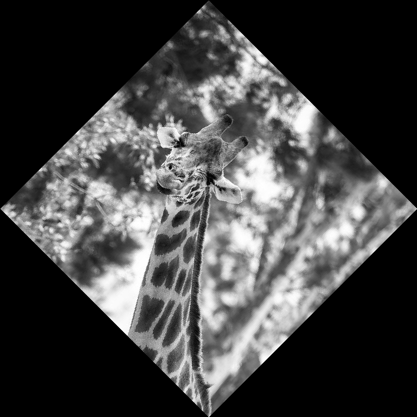

# Image-Kit-Util (WIP)

Image-Kit-Util provides a simple and clean interface for image manipulation in Go. Perfect for generative art and automated image manipulation scripts.

### Supported operations:
- Crop
- Rotate
- Translate
- Sort pixels by hue
- Quantize
- Greyscale conversion
- Split/Combine images

## Example

```Go
package main

import (
    "github.com/svader0/Image-Kit-Util"
)

func main() {
	img, err := LoadImage("res/test_image.jpg")
	if err != nil {
		panic(err)
	}

	// Crop the image to a square
	img = Crop(img, 0, 0, 500, 500)

	// Rotate the image by 45 degrees
	img = RotateDegrees(img, 45)

	// Convert the image to grayscale
	img = ConvertToGray(img)

	// Save the image
	err = SaveImage("res/test_output.jpg", img)
	if err != nil {
		panic(err)
	}
}

```
| Before | After |
|--------|-------|
|       |      |

## TODO / Needs Work

- Current quantize and pixelsort algorithms are SLOW! Images over 1000x1000 take significant time to render.
	- Supports KMeansQuantize but this implementation is much worse...
- New features to add soon:
    - Drawing shapes, lines, text, etc. on image.
    - Support for image overlays
    - Hue shift
    - Range hue shift